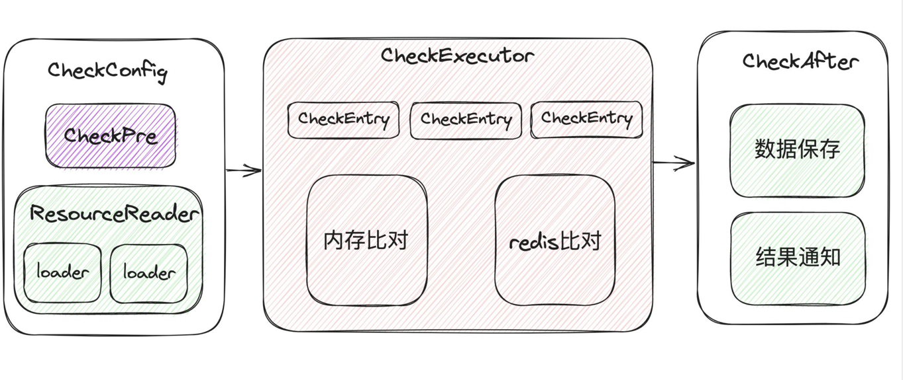

#### 1. 对账引擎原理

#### 2. 配置参数释义

> CheckConfig参数配置信息

| 字段        | 是否必填 | 释义                                                |
|-----------|------|---------------------------------------------------|
| id    | 是    | 对账唯一标识:进度管理以id为主 name与id不可同时为空                    |
| name | 否    | 对账名称: 名称可能重复                                      |
| batchSize | 否    | 单批次对账数量(防止内存泄漏)                                   |
| allowableErrorRange | 否    | 可允许误差范围 对比范围Math.abs(allowableErrorRange) 只能比较BigDecimal |
| checkCacheEnum | 否    | 使用何种对账方式(默认内存) redis/memory                       |
| redisConfig | 否    | redis配置/集成Spring                                  |